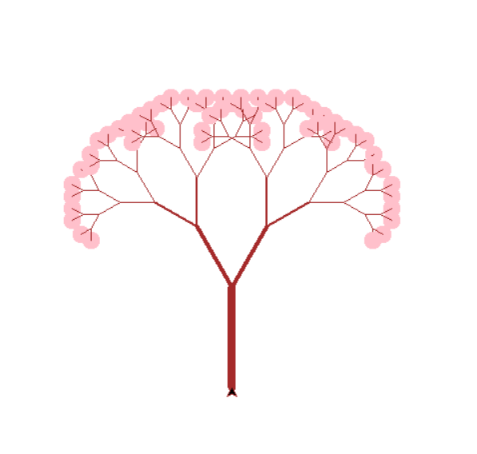

<html>
    <head>
        <title>tree</title>
    </head>
    <body>
        
        <h1 style="text-align: center;font-family:tahoma">Tree</h1>
        
        
            

               <pre>
import turtle
def Tree(d,r,w):
    if d < 10 or r < 10:
        return turtle.dot(18,"pink")
    turtle.pensize(w)
    turtle.forward(d)
    turtle.pensize(w*0.5)
    turtle.left(r)
    Tree(d * 0.7, r,w*0.5)
    turtle.right(2 * r)
    Tree(d * 0.7, r,w*0.5)
    turtle.left(r)
    turtle.backward(d)

turtle.tracer(0)
turtle.pencolor("brown")
turtle.left(90)
turtle.update()
Tree(100, 30,8)
turtle.mainloop()</pre>

                
                
                <a href="file:///C:/git/FC02031/S9/django1/triangle.html">
                     Triangle
                </a> 

            

            
        
       
    </body>
    </html>](../../FC02031/S9/JUNGLE.png)